## Machine Learning Diagnostic
What is the next thing we should think about after learning many algoithm? It must be helping us to solve some problem.

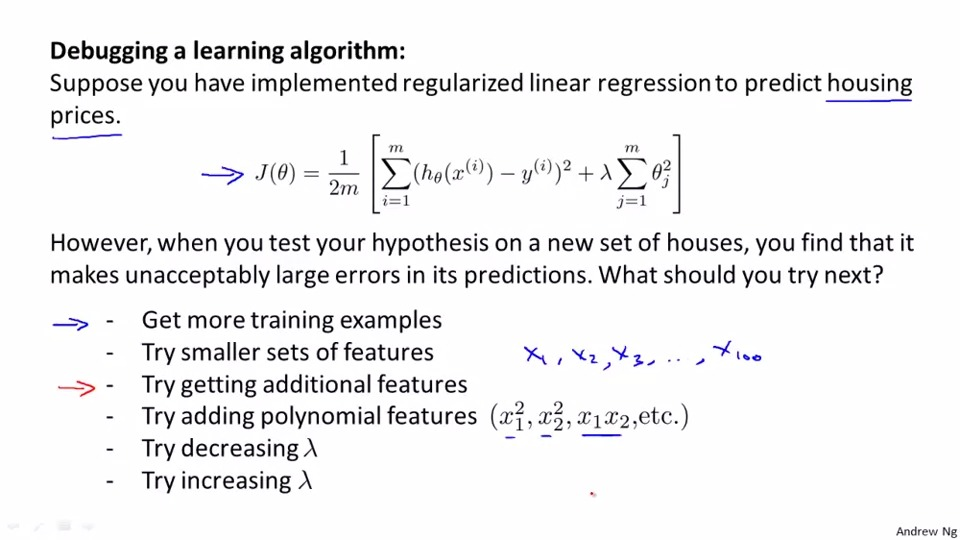

provided that you found the large error in the prediction will you get more traning example or try smaller sets of features or anything else, but doing any one of them may cost you half of year and without fixing the problem so we need to find out what 'character' appeared in your prediction and gives out the medicine(the solution above) to 'cure' the hypothesis

this is the definition of diagostic

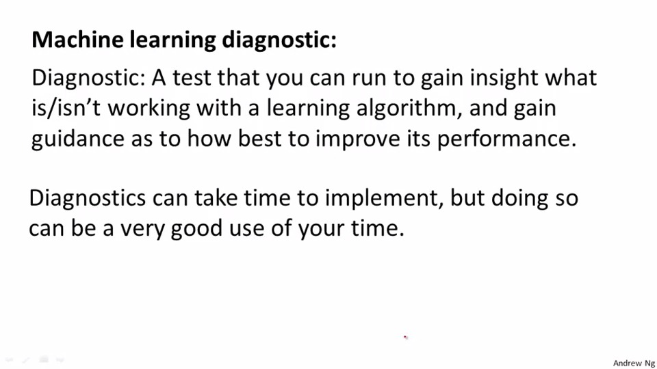

## Evaluating the hypothesis

Basically , we randomly hcoose 70% of your data as training set and 30% of data as test set

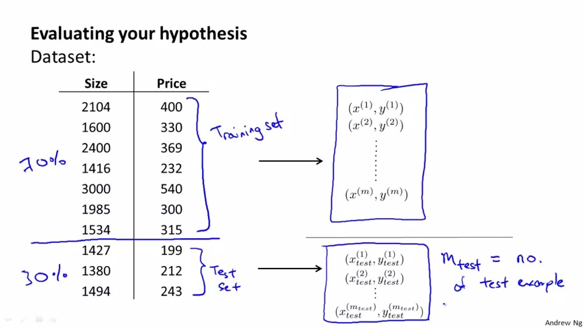
In linear regression, we learn theta from trainng data and compute the test set error using theta from training data
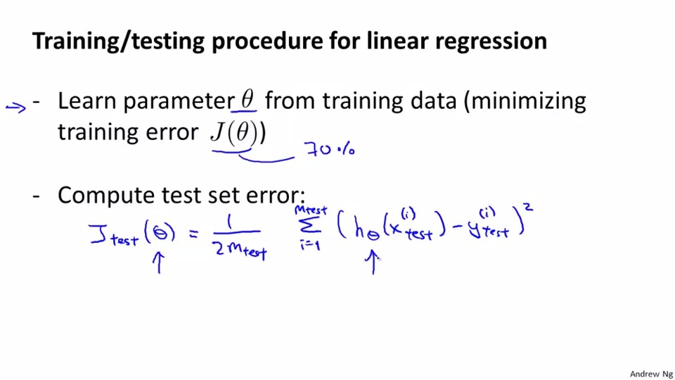

In logistic regression, it is simliar to linear but using the cost function of logistic regression,then calculate the misclassification error ,1 when error 0 when it's not
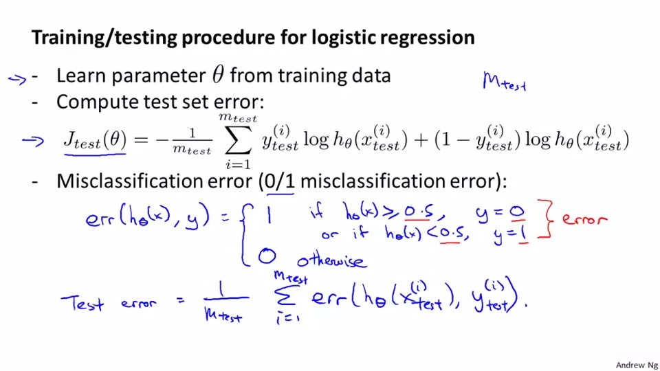

## Model selection and Train/Validation/Test Sets

just checking the error with test set is not enough to prove that it is a good prediction as it might overfitting, so we will divid one more portion of our data to check it is overfitting or not

we will divid 60% of data set for training set and 20% for the cross section set and 20% for the test set as well

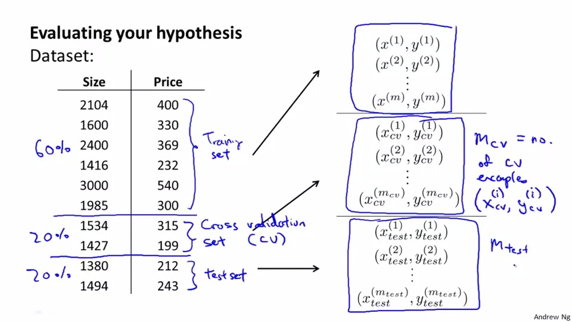

we train the data with different number of parameters and find out the combination with the smallest function and we take it as jcv(theta), we will use the degree of parameter obtained in jcv(theta) and use it in testing setand to estimate the generalization error
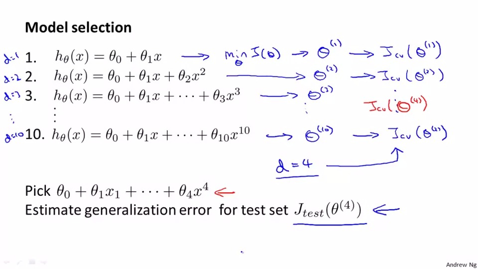

## Bias or variance?
is there any indicator to tell us the prediction is high bias(underfit) or variance(overfit)?


let's see the graph of the error with respects to the increase of degree of polynomial d, the training error will decrease all the time, but as paramete is overfit the cross validation error will be high when d is large
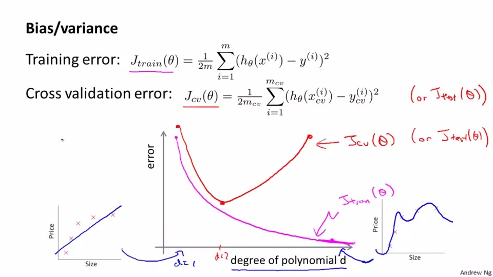
so how to classify?
```
if J_train(theta) is high && (J_CV(theta) simliar to J_train(theta))
then it is bias(underfit)

if J_train(theta) is low and J_CV(theta)>>J_train(theta)
then is is variance(overfit)
```
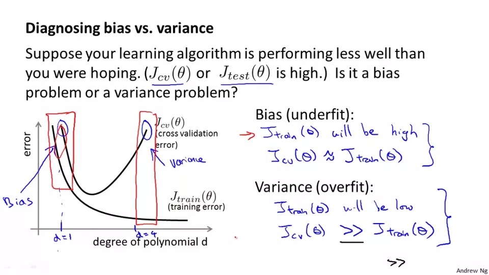
## Regularization and Bias/Variance
this is the brief introduction of regularization
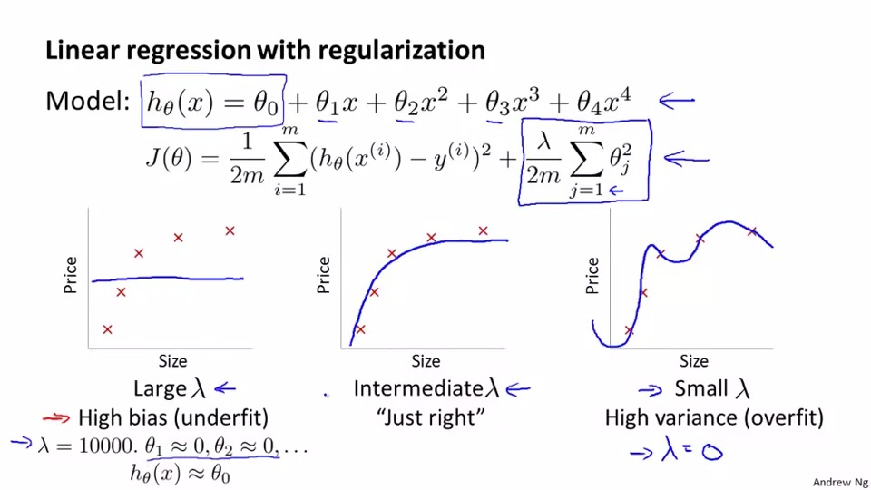
How to choose the best lambda? it is to try and error the best value of lambda by using the data set of jcv(theta)
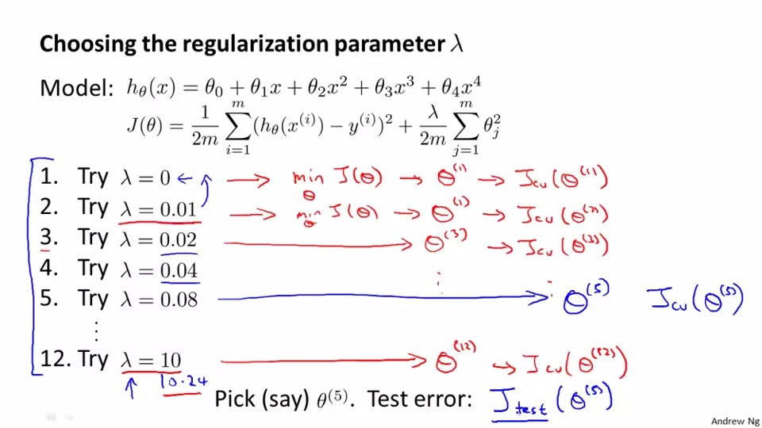
To conclude(with respects to the increase of lambda):

Overfit when J_test(theta) is small and j_cv(theta) is huge

Underfit when both of them are huge and they are simliar
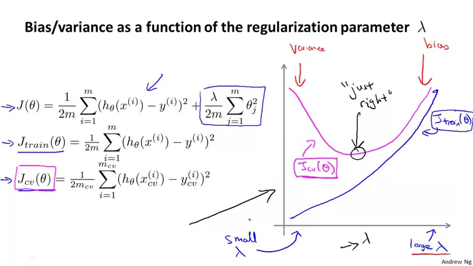
## Learning Curves
Learning curves means drawing graph to look the change of error with the increase of number of training set,(e.g. training the prediction from 1 of 100 and plot,2 of 100 and plot and so on)
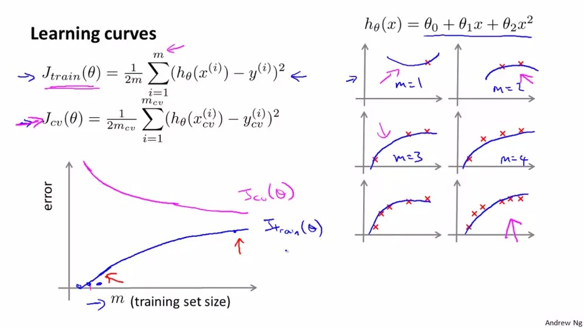
from the observation we know that the error will remain unchanged with the increase of m, which means the increase of training data will not help much if it is suffering from high bias
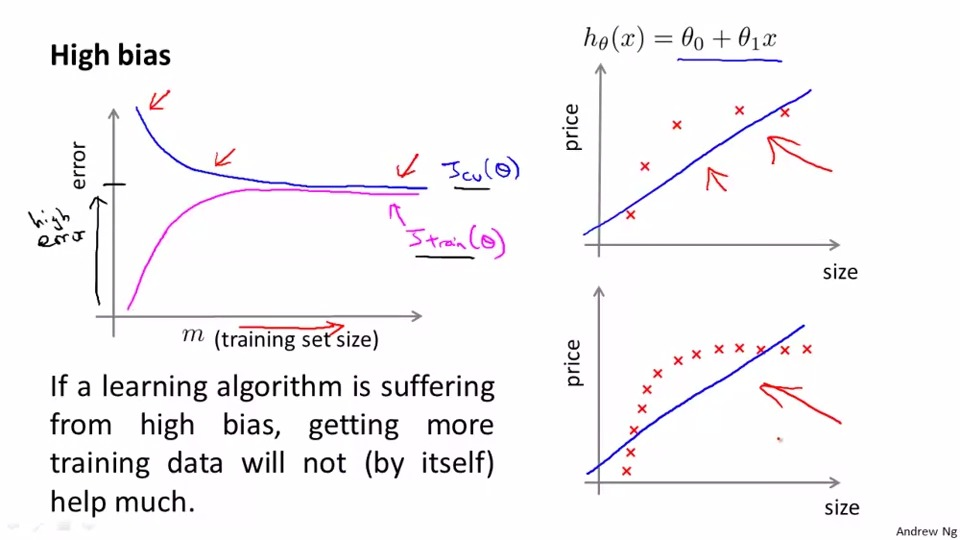
from the observation, we know that the gap of two errors become more and more narrow, which means the increase of training data can improve the situation if it is suffering from high variance
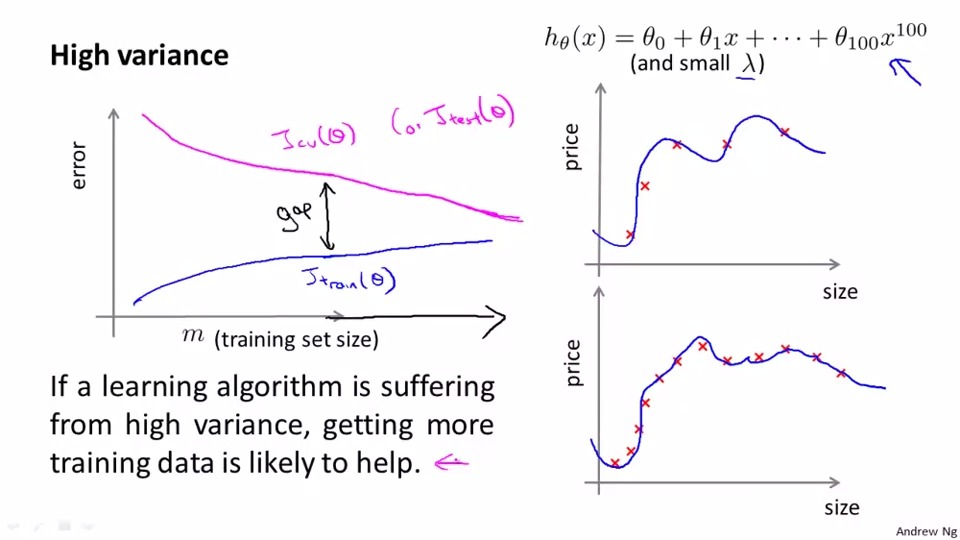
## Wish we can turn back time, now we are standing at the crossroad
Now we are at the origin of this chapter, how we determine the solution we use
For high variance:

1. get more training example
2. trying smaller set of feature
3. try increasing lambda

For high bias:
1. try getting additional features
2. try adding polynomial features
3. try decreasing lambda

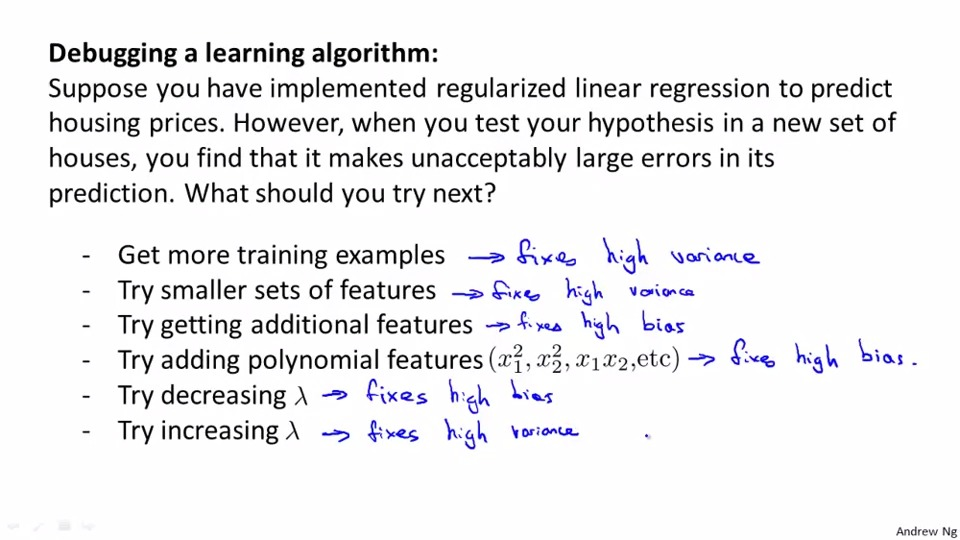
In nn,
underfitting:
increase the number of layer and parameter

Overfitting :
use regularization to address overfitting

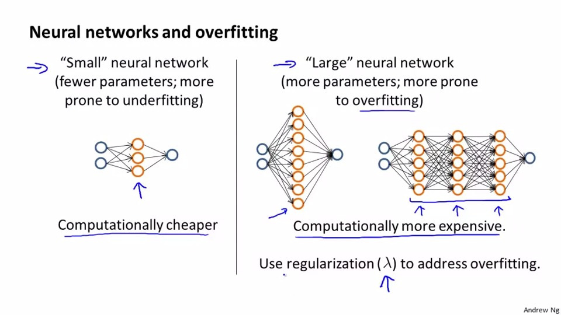