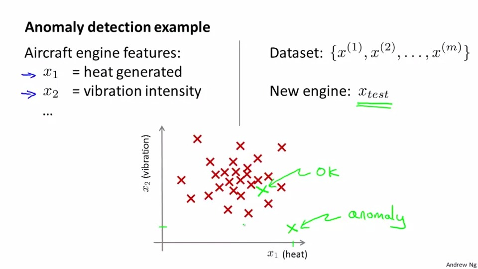
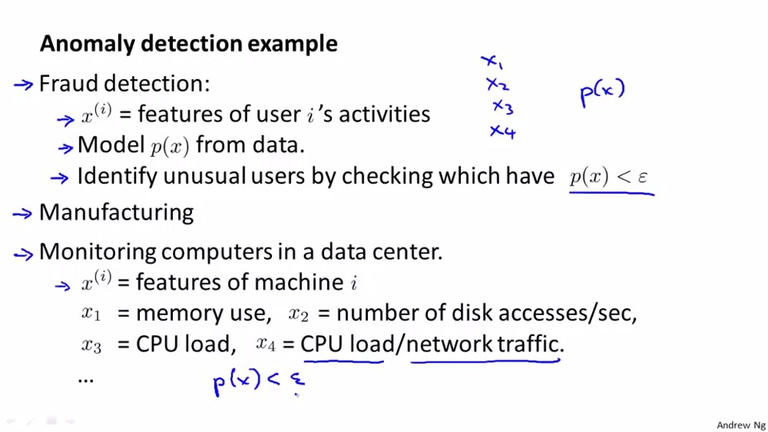

## ANomaly detection
We have trained a model with a cluster.But sometime the new example will lie out of the cluster we train. So we call it anomaly. But now to determine the example is anomaly or not?

If the model p(x) calculate the new example is smaller than a threshold sigma, we will call it anomaly, othervise we will call it ok

The anomaly detection will use in fraud detection/Manufactering.monitoring computers in a data centre.
