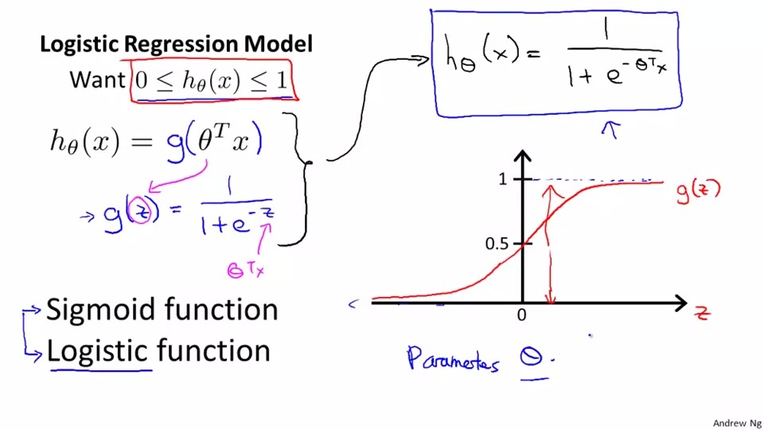
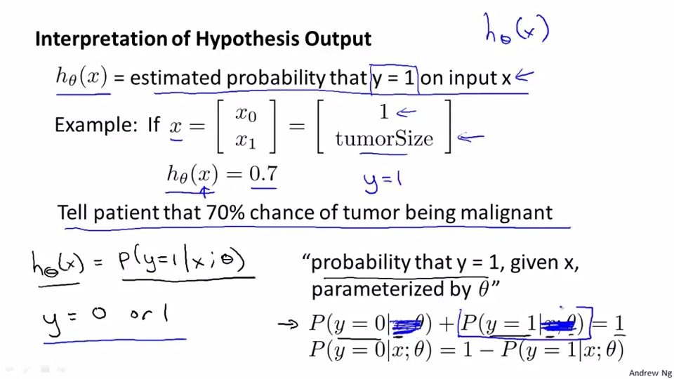
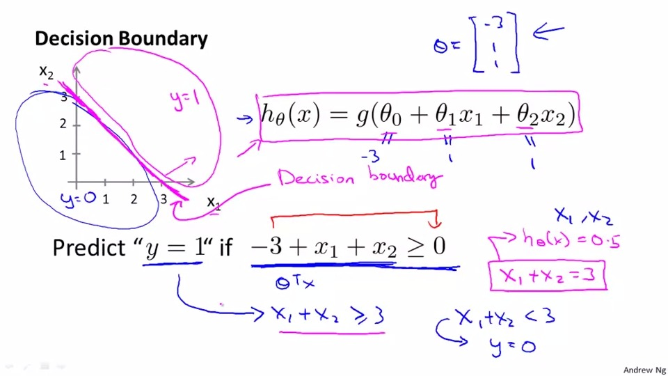

## Logistic Regression
```
y = {0,1}
```
0 = negative class (-)

1 = positive class (+)

In the past we may treat prediction <0.5 as 1 ,>0.5 as 0
but classification is not actually a linear function

so we use the binary regression algoithm in which y can only be 0 or 1.

## Hypothesis Representation
```
want 0<=h(x)<=1
```



1. the h(x) in logistic regression is different from linear regression,it is defined above

2. logistic function is also called sigmoid function

3. the curve of logistic regression is as the picture above



4. h(x) means the probability the y = 1 in input x

5. the probability that y = 0 is 1 - h(x) 

## Decision Boundary


- g(z)>= 0.5 , then z>=0

- because theta^T*X > 0, you can apply it to find a striaght line on to the graph,it is called the decision boundary, provided that the value of theta was given.
