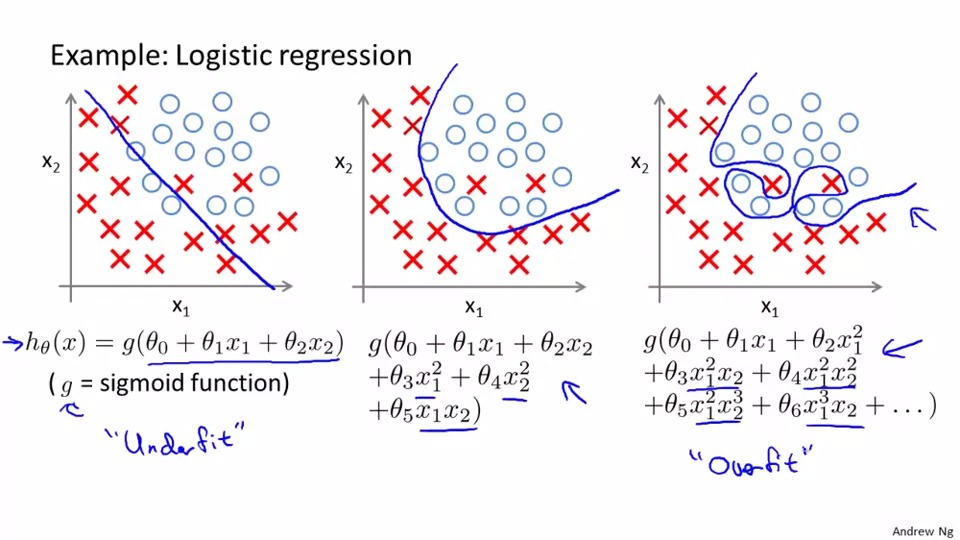

## Cost Function


We take the cost function in linear function and modify it to be logistic function as below
```
cost(h(x),y) = 1/2 (h(x)-y)^2
```
The cost function is said be convex if it is being used as logistic regression


in the cost function, it has two function used if y = 1 or y = 0

if y = 1, h(x) = 0 , the cost function will be equals to inf(the cost is extremely high)

On the other hand, when y = 0, h(x) = 1 , the cost is also high, and the shape is came as above

Thus ,due not to pay the high cost, we combine two cost function together.

## Apply gradient descent to simplified cost function


- we use the new cost function as above to calculate logistic regression, the y = 0 part will be cancel out if y is equals to 1,vice versa.


the algoithm is doing the iteration which is same as the linear regression, it is recommended to use <mark>vector to calculate </mark>each iteration in the programming assignment

## Advance optimization


- in optimization algoithm, we need to calculate the partial derivative of cost function
and plug it into the gradient descent


but instaead of gradient descent 
it has conjugate gradient, BFGS etc 


the function is used as above

in order to use the function fminunc(), the example code is
```
function [jVal, gradient] = costFunction(theta)
  jVal = [...code to compute J(theta)...];
  gradient = [...code to compute derivative of J(theta)...];
end

options = optimset('GradObj', 'on', 'MaxIter', 100);
initialTheta = zeros(2,1);
   [optTheta, functionVal, exitFlag] = fminunc(@costFunction, initialTheta, options);
```
notes: remeber to use '@' before 'costFunction' while using fminunc();
## Multiclass Classification: One-vs-all
In the logistic regression taught before, it is only have two cases(y=0,y=1), this chapter is to show if y have more than 2 value.

example :

when we need to find h1(x) we can classify the line that y = 1,

when we need to find h2(x),we can classify the line that y = 2,
 
 and so on...


the aims is to maximise all hi(x)

## Overfitting
```
Overfitting means the prediction is too accurate that it will fail to predict with new example
```

Example of overfitting in logistic regression



note: In other words, overfitting is good enough to predict the examples in the training set, but not the examples out of the training set.

## Underfitting
Underfitting means there is inaccurate to predict the data because there are a few of example in training
## How to address overfitting

1. drop features
2. regularization

## Regularization


- The cost function will become overfitting because <mark>some of the parameter become too large</mark>, in order to reduce the effect of every single parameter ,we will add the regularization terms which is lambda * summation of theta 1 to theta n


note:the cost function will be underfit if the regularization parameter lambda is too large.

## Application of regularization

Gradient Descent

(1-alpha*lambda/m) is less then 1, which means theta j is decreasing ,it is the aims of regularization
Normal equation
