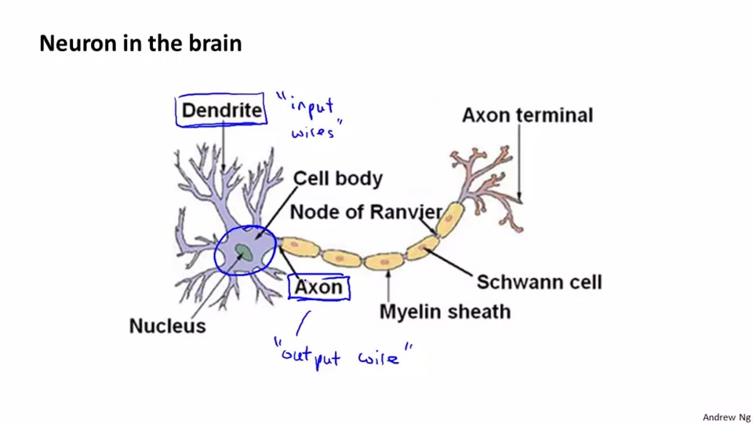
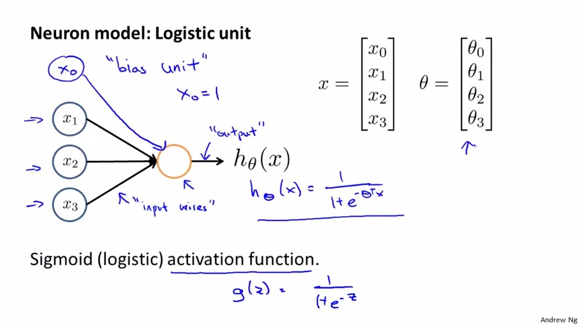
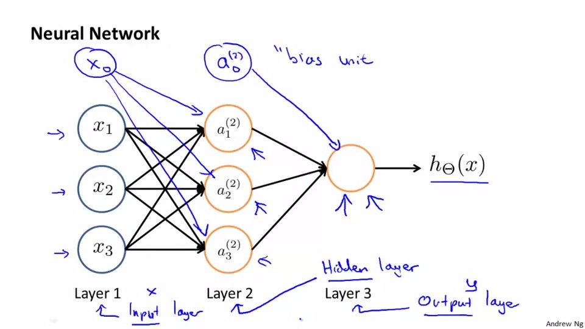
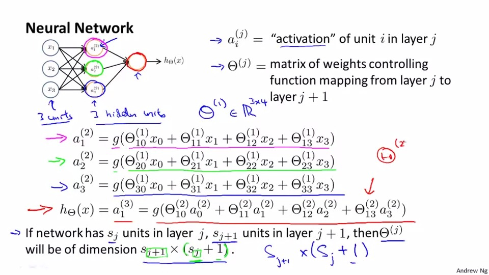
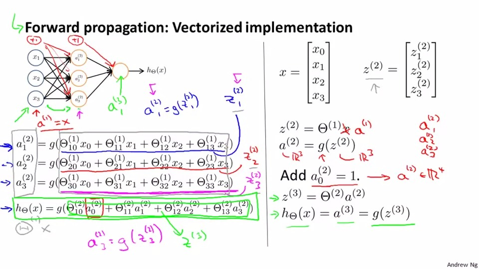
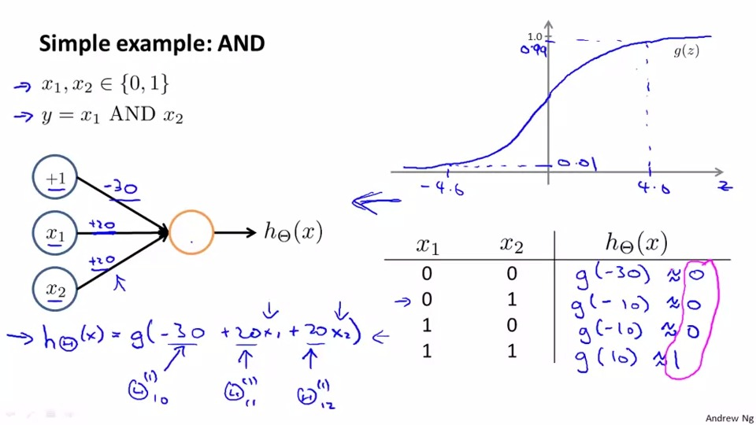
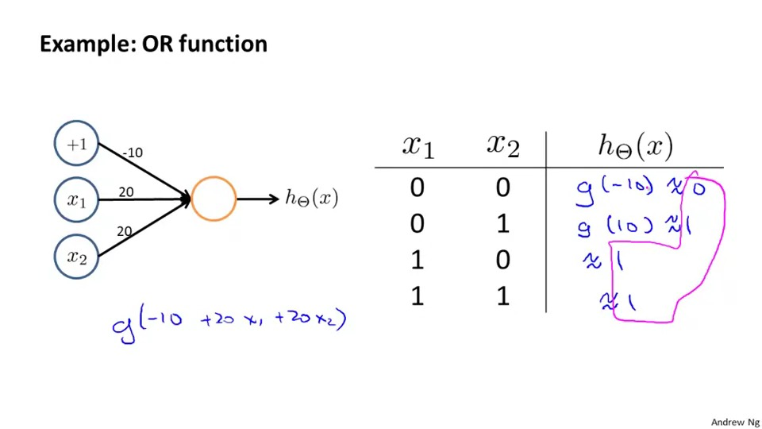
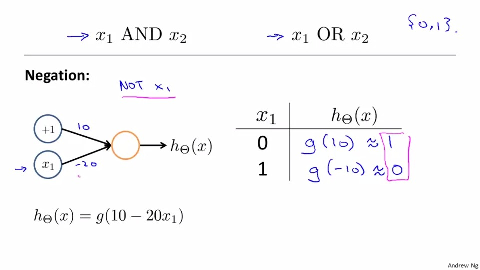
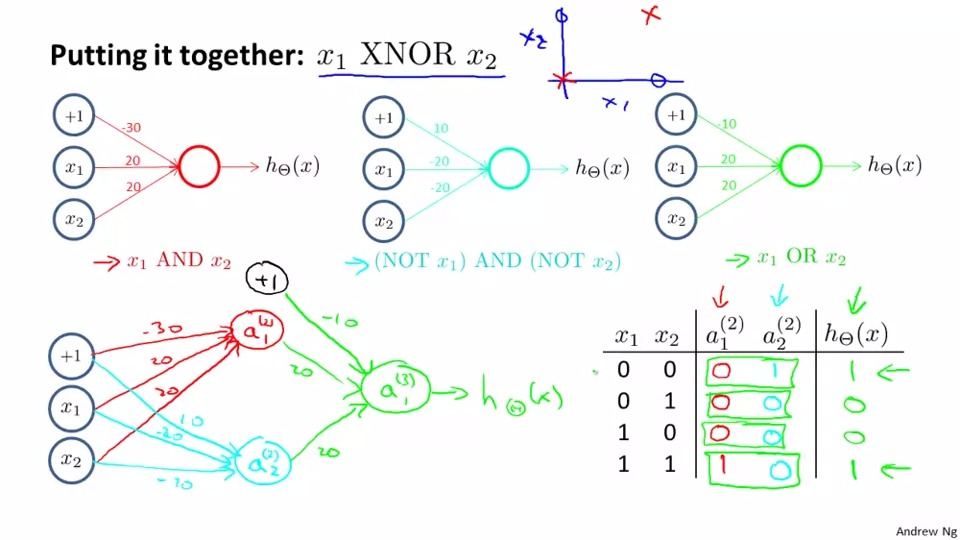
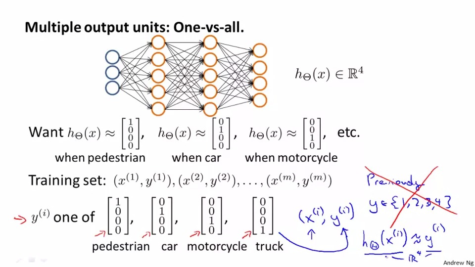

## Neural Networks
Why we need the Neural Networks while we have linear regression and logistic regression?

Although those two regression is useful, but it is costly in computation when the number of feature is too large (>100)

eg: the terms of 100 feature can be around 5000(n^2/2)

In a neuron in the brain, it mainly consists of three part
Dendrite(input wire), Nucleus(process unit), Axon(output)

In a Neuron model, it is as same as a logistic function with more than one layer.

In a Neural Network, the first layer called <b>input layer</b>,

the final layer called <b>output layer</b> 

and the layer between two layers are <b>hidden layer</b>, a0 is the bias unit.

The value of element in the second layer is calculated with same x but different value of theta ,then the output is also calculated as above. the dimension of theta is s(j+1)*(sj+1)

How to calulate the output with vectorized implementation(forward propagation)?
1. caluate z1 = theta1 * a1
2. calculate a(2)= g(z^2)
3. a0^2 = 1
4. calulate z2 = theta2 * a2

and loop until you find the output

## Some example of non-linear example of Neural Networks

In order to present the xor function in Neural Networks
we need to learn how to present logistic function below:

AND Function 

OR Function

Negation Function

XNOR Function 
1. take the features with AND operation and NAND operation seperately.
2. take the results in step 1 with OR operation
the opration is shown as below

## How to present the classification problem with Neural Networks 

output value is the boolean value of the object you classify. Each row represent one object.
