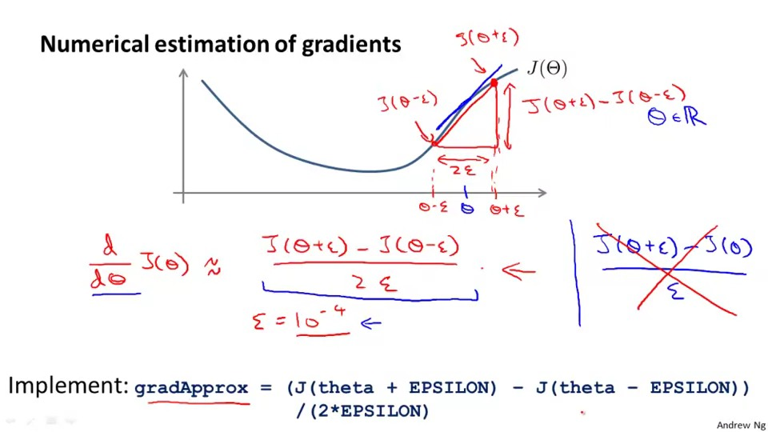
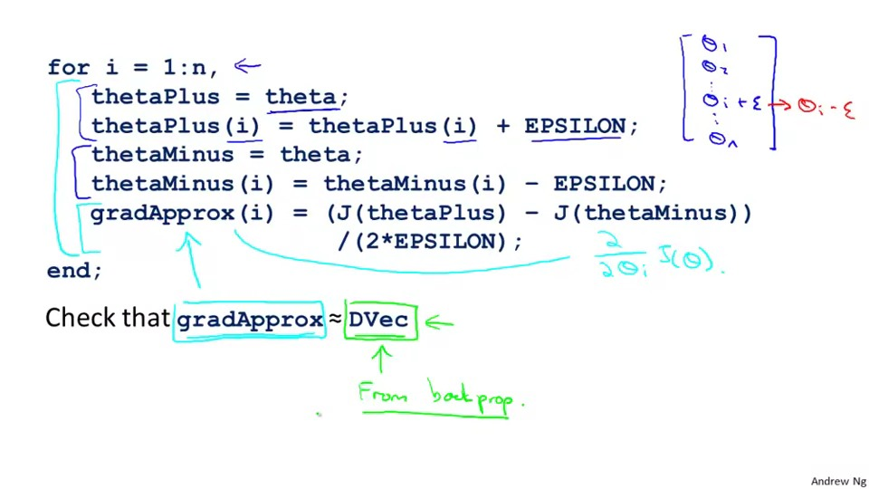
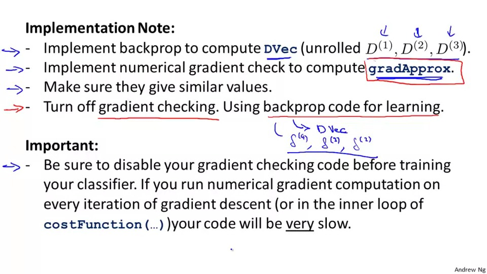
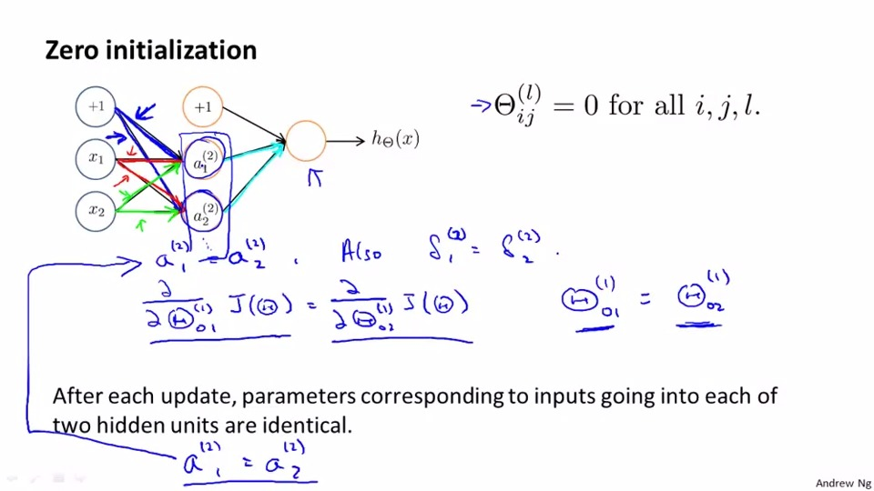
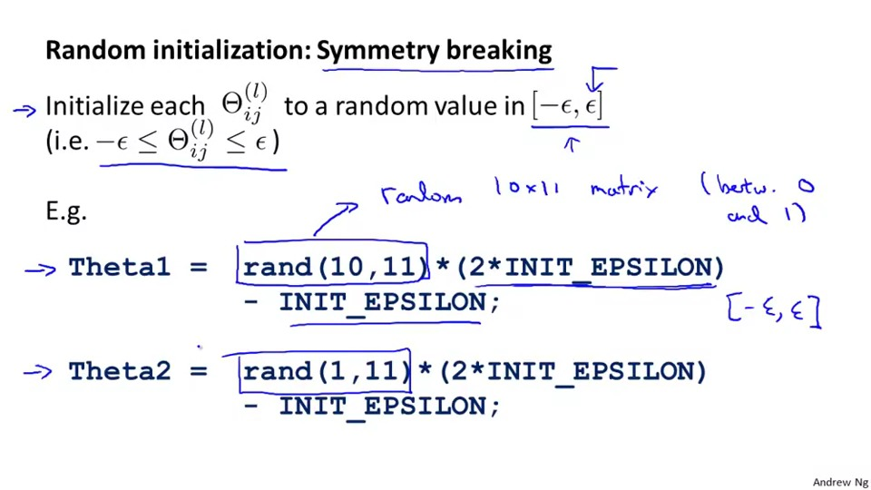
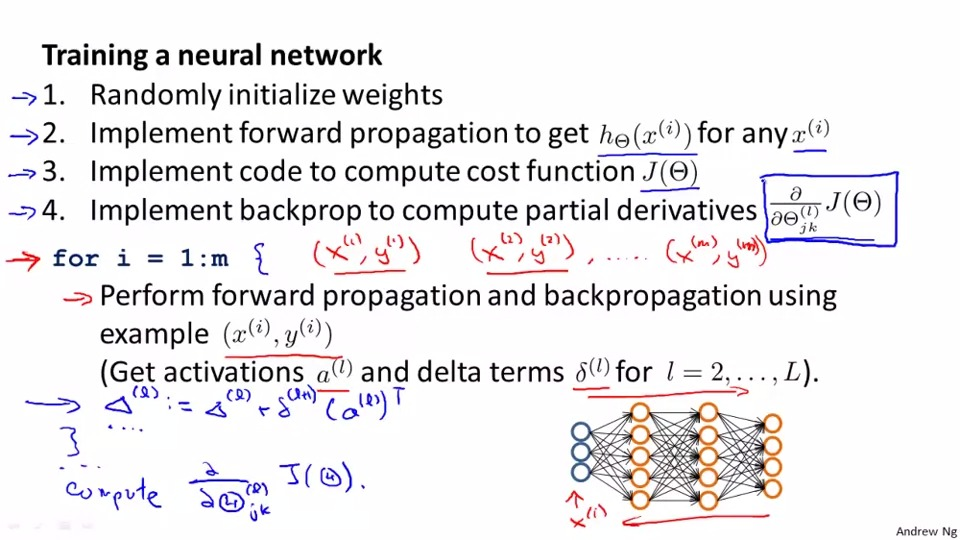
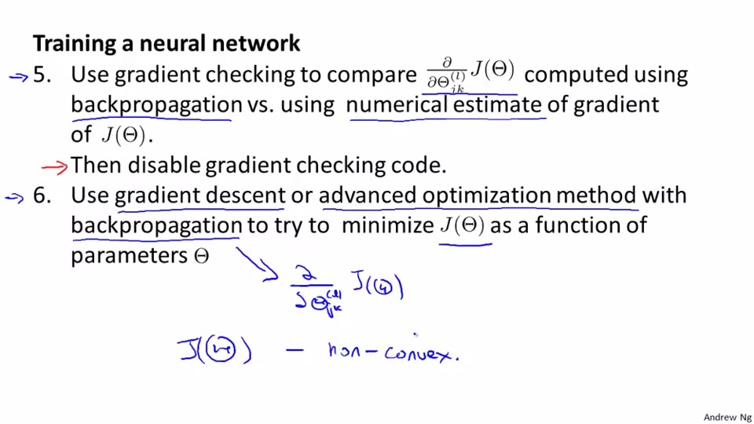

## Unrolling the parameter
In the Nerual Network, we need to unroll the matrix to the one row vector in order to use optimizing functions such as "fminunc()"

```
thetaVector = [ Theta1(:); Theta2(:); Theta3(:); ]
deltaVector = [ D1(:); D2(:); D3(:) ]
```

if the dimensions of Theta1 is 10x11, Theta2 is 10x11 and Theta3 is 1x11, then we can get back our original matrices from the "unrolled" versions as follows:

```
Theta1 = reshape(thetaVector(1:110),10,11)
Theta2 = reshape(thetaVector(111:220),10,11)
Theta3 = reshape(thetaVector(221:231),1,11)
```
To summarize:


## Gradient Checking
In order to check the gradient descent is in the right direction, we can use gradient checking.

The code expression of gradient checking:

Some important notes of gradient checking: 

1. turn off gradient checking before training thr classifier or it will be very slow

## Random initialization
Why we need to use random initialization? Why we don't use the previous method(zero initialization)?
The picture below tells us the answer. because all parameter is identical if we use zero initialization, then the partial differentiation is identical, then it will subtracting(adding) with same value each update, those hidden unit will become <b>identical</b> every update.


That's why we need random initialzation, it is to prevent they have the same parameter(symmetry breaking).



it is to initialze the theta to a random value in range of -epsilon to epsilon
note: those two parameters in rand() function, is to detemine the row and the column of the random matrices you want.

## put those things we learnt in this chapter together

