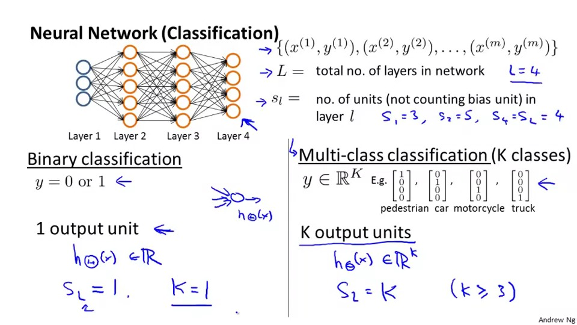
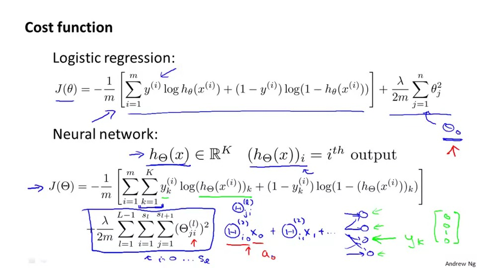
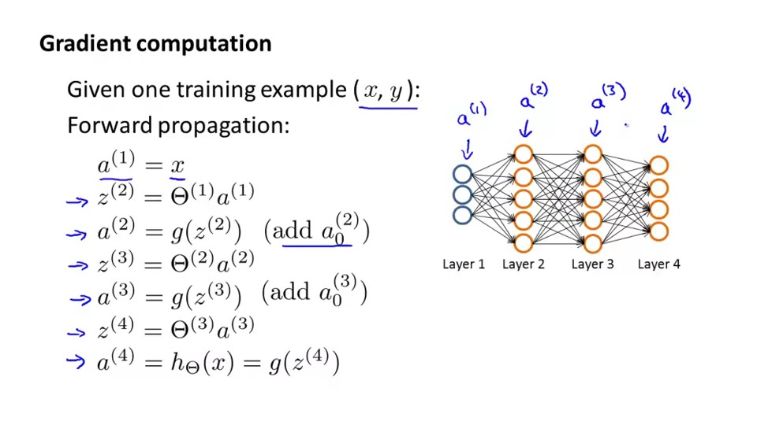
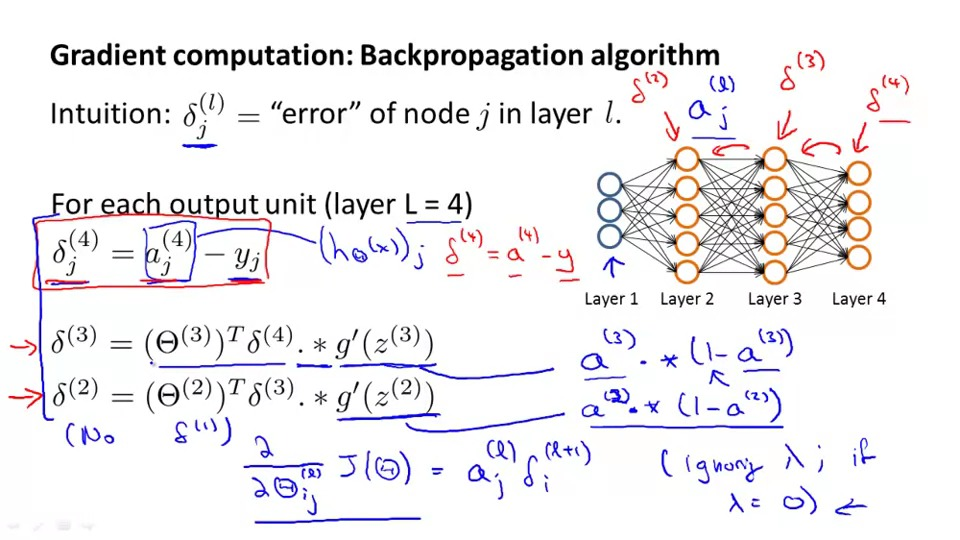
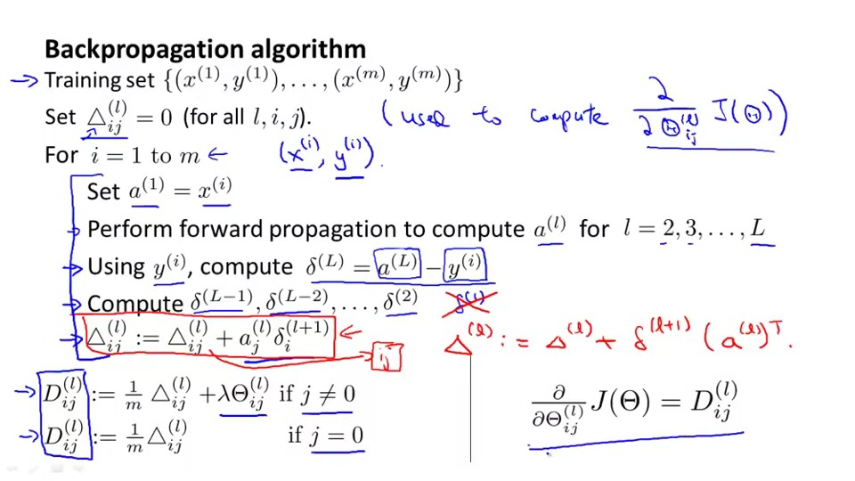
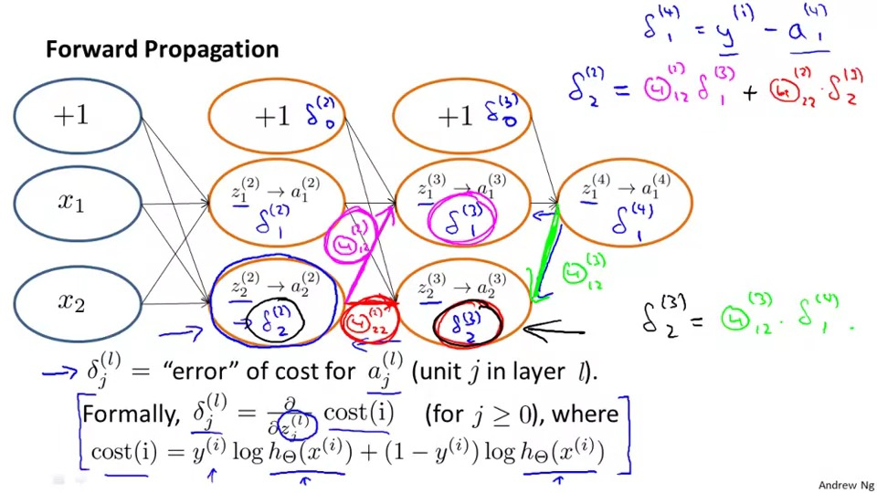

## Cost Function and Backpropagation
Let's recap the Neural Network, 
parameter:


The difference between in binary classification and Multi-class classification is that Multi-class classification can have more than one unit and binary classification can only have 1 unit(y=1 or 0)

The cost function of the Neural network is shown in below:

Discription: you can see the cost function of the Neural Network has two summation terms.

In the first summation term:
you will see it will have a extra summation term from 1 to K comparing to the cost function in logistic regression,which means we will add the cost of every output together in the inner loop and add the cost of every training example in the outer summation

In the second summation term:

you will see three summation term in it, firstly, please ignore the outermost summation first, imagine the matrix of the theta in every layer, the row of the layer corresponds to the element of next layer(let's say theta(1,i) is the theta a(1) needs)
,column means the theta relevant to in this layer. For example, theta(1,1) is the theta for the x1 'gives' to a1.

Then the outermost summation means that it will iterate in every layer.

## Backpropagation Algoithm

In order to minimize the cost function, we need to compute two things first:

1. J(theta) (cost function)
2. the partial defferentiation of cost function

To find the J(theta), we will use the <b>forward propagation</b>(learnt in the last chapter),find the zi,then  find the g(zi)



To find the partial d of cost function, wee needs to find the small delta first.

The small delta means the error of node j in layer i

1. because we have the a of the last layer(calculated in the previous step) and the y(given in every example)
. Thus we can find the small delta in the output layer

2. after finding the small delta of the last layer, we can find the small delta of the second last layer by the following formula:
```
delta(i) = theta(i)delta(i+1) .* g'(z(i))
where g'(z(i)) = a(i)*(1-a(i))
```
then you can calculate the small delta in every layer except the input layer

3. finally the partial differentiation of the cost function in every theta is equals to a(l)(j)*delta(l+1)(i)
please reference to the figure above.
4. the summation of all partial differentiation is the big delta
5. the delta we want is the big delta / m + the lambda * theta(i,j)


## Backpropagation Algoithm Intuition



it is simliar to the forward propagation, but this time is not in terms of a, it is in terms of small theta.


