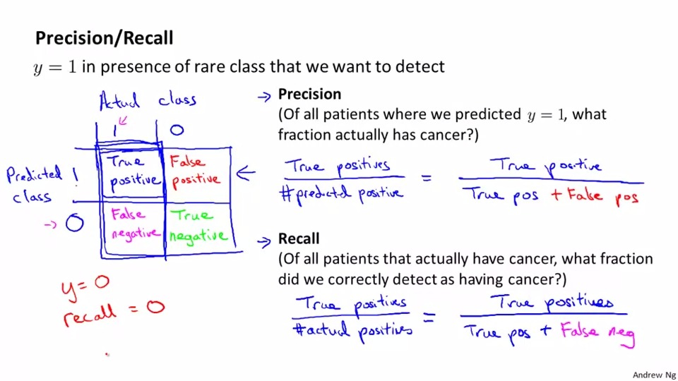

## Machine Learning System Design
So we would like to build a spam detector, it is 1 when it is a spam and it is 0 when it is not a spam.

In order to build a spam classifier, we woul like to choose the key words of spam email(x = 1 when the word appear, x = 0 when the word doesn't show up.)

we may choose ten thousands of words to do a spam classifier.

Doing something to have a low error

1. collect more data
2. adding more features in email header
3. add algorithm to detect misspellings

## Error analysis
For eample, if the algoithm misclassifies 100 emails, what you first need to do is to categorize them error and find out which type of the email is misclassified most. Then we think about can I do something about it(is there anything wrong in classifing those email)

## The importance of numberical evaluation 
Example:
Should we treat discount/discounts/... as the same word?
How: using stemming software

cons:
it may treat some different words as same words wrongly (e.g: universe/university)

so how to determine will we use the stemming software or not

solution:
To choose the result with least error,but note that be aware of overfitting

## Error Metrics for Skewed Classes
ley say a model with 1% error, which means 0.5% patients have cancer and 0.5 haven't (as the extreme in normal distribution curve).We call the error rate as skewed classes. But the smaller the skewed class doesn't mean the better the model

So we introduce two classifier precision/recall
Precision means what is thefraction actually has cancer when we predicted y = 1?

Recall means what fraction did we correctly detect as having cancer , while the patientlys actually has cancer.

in logistic regression, we predict 1 when h(x)>0.5, 0 when h(x)<0.5.

If we wants to predict more strictly, predict 1 if it is certain. So we higher the threshold to 0.7
The result is that it will high the precision and lower the recall.

If we just don't want to miss too many cases, we lower the threshold, which will leads to high recall but lower precision.

So How to compare the precision/recall number?
obvious;y, P+R/2 is not a good choice(cannot prevent extremely high recall/precision)
we will use 2(PR)/(P+R)

## Large Dataset
Here is an example of of training a classifier between confusable words, Banko and Brill use 4 algoithm to train and draw a graph with respect to the traininf set size(learning curve)
The result is not who has best algoithm ,it is who has the most data learns better.

First thing we should consider in training a large dataset is to use a expert aspects: Do you think an expert can classify the output after getting this set of parameters? If it can, keep the amount of features. If it can't ,add some more features

If we use a learning algoithm with many prarmeter, it will be a low bias algoithm the J_train(theta) will br small
If we use a very large training set i will be a low variance algoithm
the J_train(theta) will be simliar to J_test(theta)
and the J_train(theta) will be very small 
