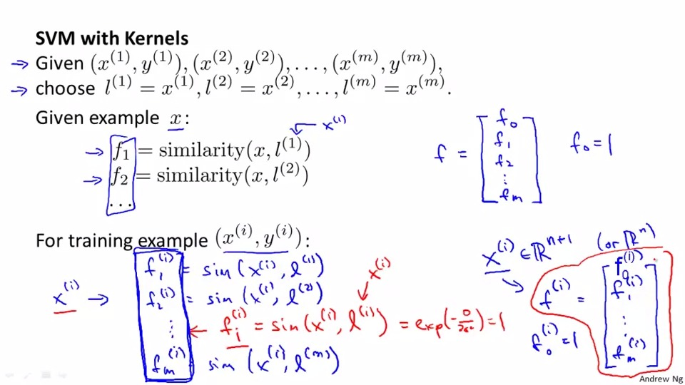
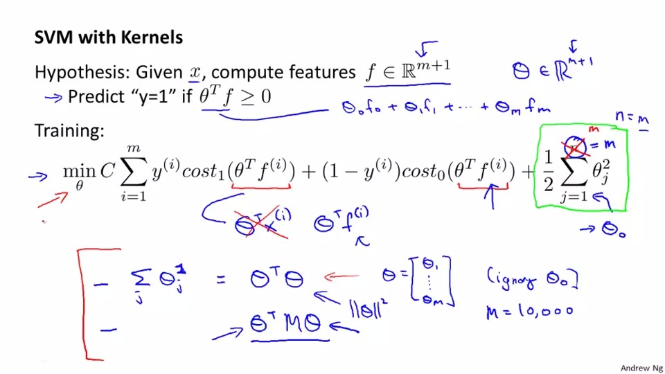
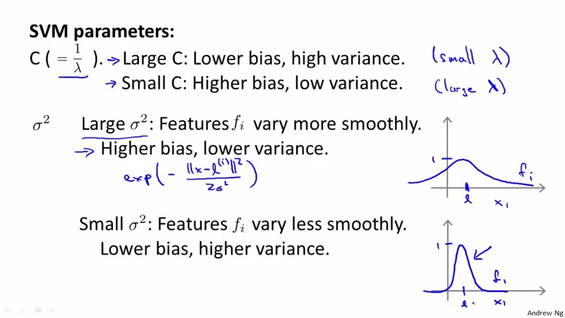

## Kernel
so given x ,we approxmately draw landmark(i) to present the predict

Kernel means the simliarty of x and landmark.

The equation is:
```
exp((x-li)^2/2/sigma^2)*-1

```


the graph below is proven that kernel will be 0 if x and l is not simliar and othervise.

The kernel we use is called <b>Guassian Kernel</b> 

As same as the graph below, we need to predict 1 when 

theta0 + theta1 f1+ theta2f2 + theta3f3 >= 0

through subsitution , we can circle the boundary which can draw some non-linear classifer.

we can express f in term of vector and the number of row of l should be equals to number of row of x

then we sub l to x in training and note that the summation of theta^2 is equals to theta^t * theta.
But we can use function like func() so don't worry about the math

What we should worry about is the SVM parameter

Larger C will leads to low bia, high variance,vice versa

Largr simgma^2 will leads to higher bias.and lower variance,vice versa.
