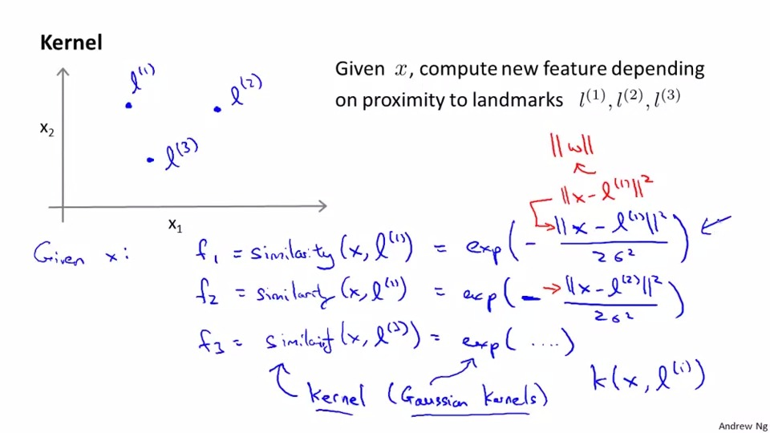
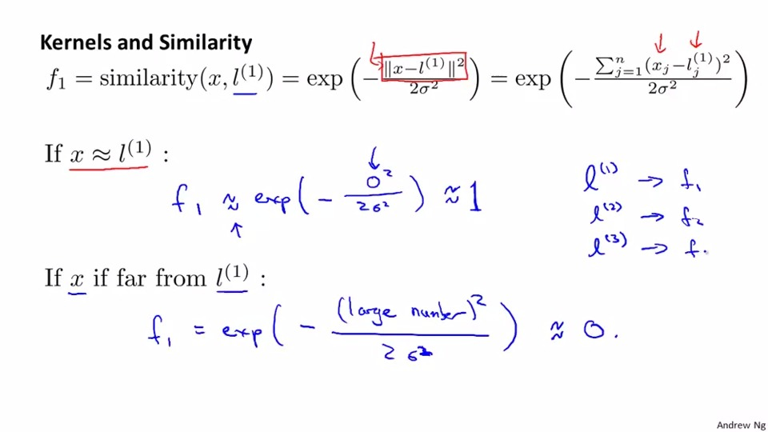
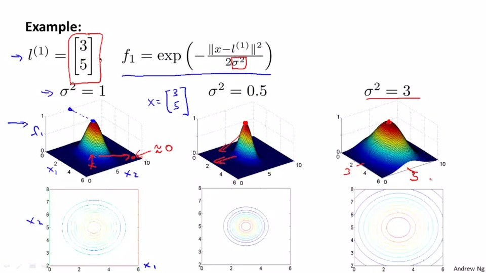
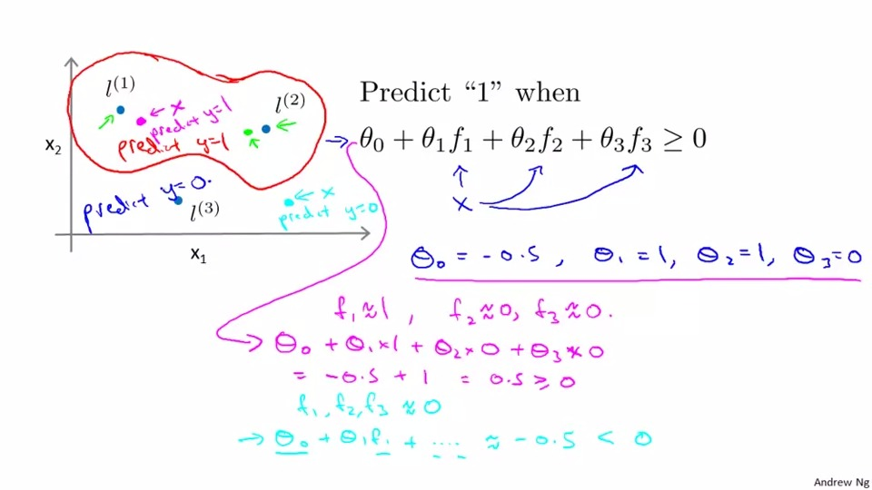

## Kernel
so given x ,we approxmately draw landmark(i) to present the predict

Kernel means the simliarty of x and landmark.

The equation is:
```
exp((x-li)^2/2/sigma^2)*-1

```


the graph below is proven that kernel will be 0 if x and l is not simliar and othervise.

The kernel we use is called <b>Guassian Kernel</b> 

As same as the graph below, we need to predict 1 when 

theta0 + theta1 f1+ theta2f2 + theta3f3 >= 0

through subsitution , we can circle the boundary which can draw some non-linear classifer.
