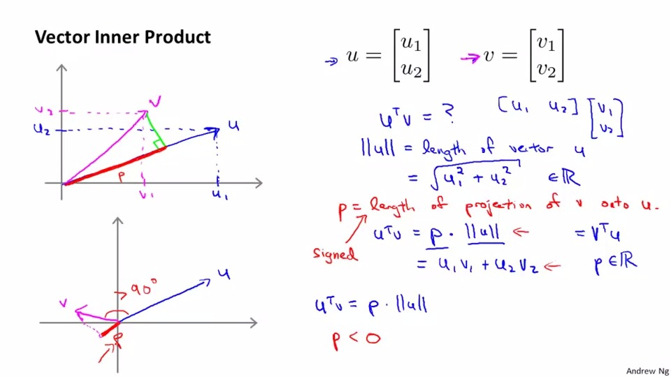
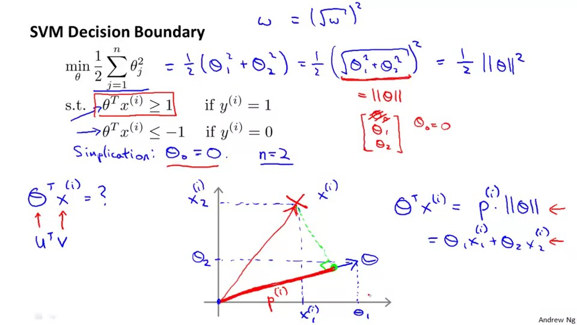
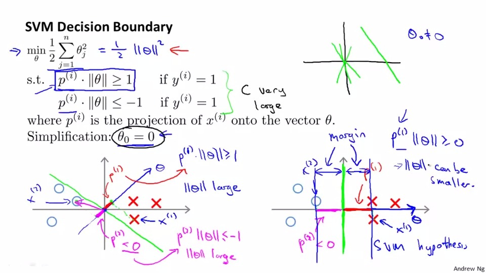

## Support vector machine
## Optiization Opjective
For the review of logistic regression
```
If y = 1, we want h(x) simliar to 1, and z much greater than 0.
If y = 0, we want h(x) simliar to 0 and z much smaller than 0.
```

So the outcome we want bt using Support vector machine(SVM) is purple line in the graph(a straight line simliar to the cost function curve)

We changed (compare to the logistic function):
1. we cross out 1/m in SVM(as the minimum are the same regardless 1/m)
2. we put the factor to the first term instead of second term


## Large Margin Classifier(another name of SVM)
So to summarize the formula and graph of SVM:
Note that the svm will be more accurate as the z needs to larger than 1 in order to make y = 1.On the other hand, the z needs to smaller than -1, when y needs to be 0.

In the figure below, you will see thst it will have plenty of ways to draw a decision boundary,the distance between the decision boundary and 0's(1's) cluster is called margin.It will be large if we use SVM.

So what's the effect of factor C?

if C is not large,it may simply have a decision boundary to boarder the majority of example but not all.

if C is  large,it may simply have a decision boundary to boarder the all of example(which may leads to overfitting).

As C = 1/lambda.


## Mathematics Behind Large Margin Classification
So we now need to prove the result of u^t *v
which is u1v1+u2v2

and we apply the proof to the case of theta^t * x

we can see theta1 * x1 + theta2 * x2 is either >= 1 or <= -1


In this graph, we can see that boardary from SVM has large margin,then the p(i) of that will be larger,which means the theta can be smaller.
