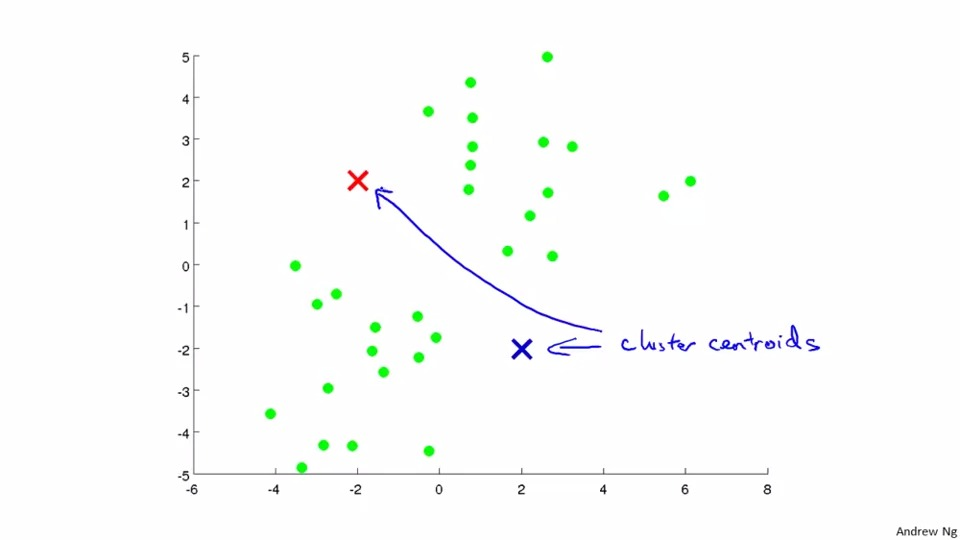

## Unsupervised Learning 
This chapter will introduce unsupervised learning.Comparing to supervised learning, we will not have y at all in unsupervised learning. We will use a pot to prpresent the training examples and we will use the clustering algoithm to group the cluster with simliar location together.

example of supervised learning:

example of unsupervised learning:

## K-means algoithm
K-means algoithm is one of the unsupervised algoithm.

We need to set the number of K cluster centroids at first. 

then you can see the red centroid will calculate the mean of the red region anf the blue centroid will calculate the mean of blue region and move the centroid until it can move in the middle of the clusters and stop moving in next iteration.

Parameter you need to know in this algoithm:

To implement the algoithm:
1. determine the number of k
2. assign the index of cluster to every training example x(with the closest distance from cluster to x)
3. calculate the mean of the every cluster
4. repeat the process until the point don't "move" in a iteration

Just a sweet reminder from lecturer, some of the case may not be as perfect as that you can see the clear clusters but we can still classify clusters in the algoithm.

## Optimization Objective
knoeing the objective have 2 purposes
1.it can help us to debug 
2.to prevent strucking on local optima

so the optimization objective is to minize the distance between cluster centroid and all its corresponding points

K-means algoithm 
1. randomly initialize k cluster controids
2. to assign x to the cluster centroids
3. to move centroid

## Random initialization
The random initia;ization is to pick random K examples and assign it to the cluster centroids

local optima means the crntroids sometimes can not as perfect as we want. It may struck at the same cluster

How to solve local optima?

We do the process so many times (100 times) and pick the clustering that give the lowest cost
