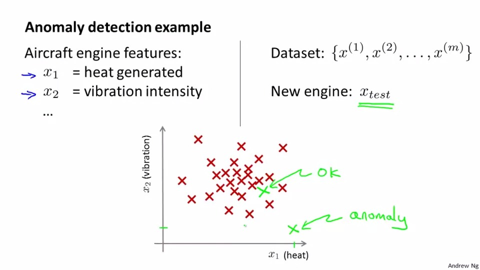
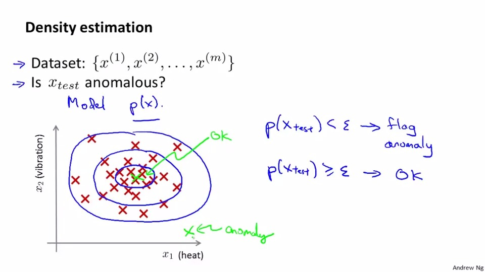
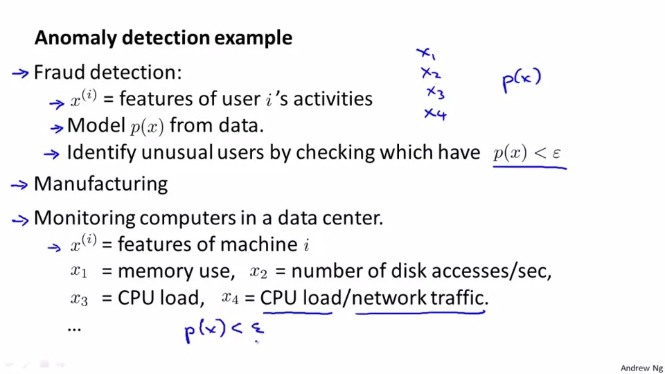
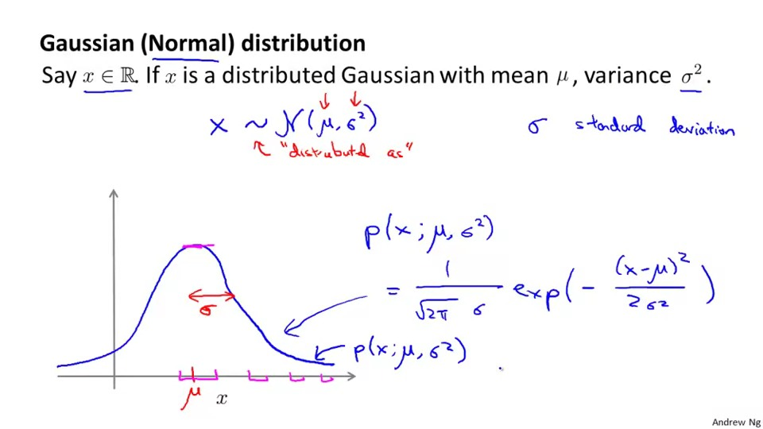
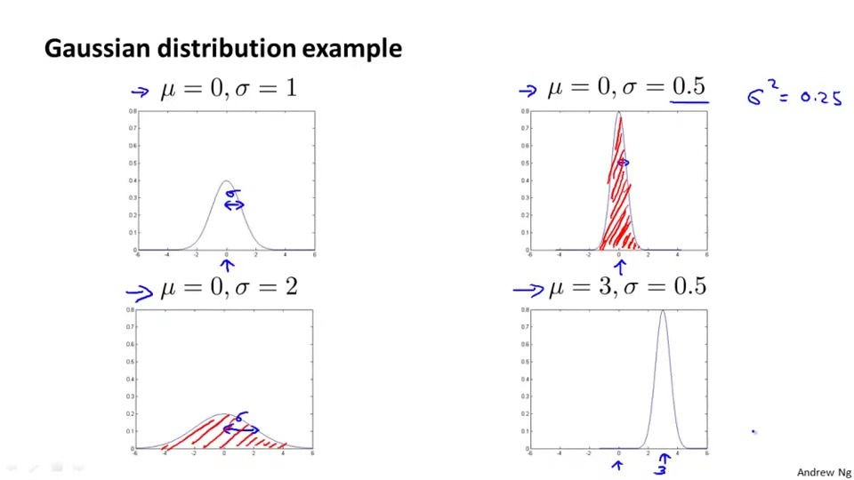
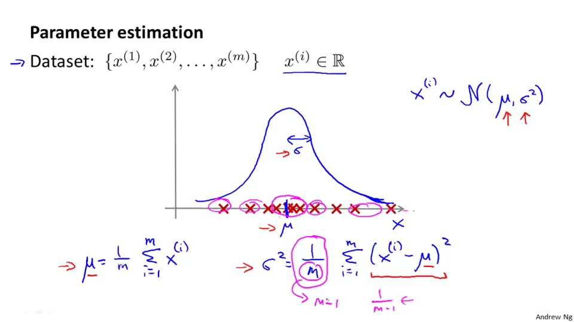
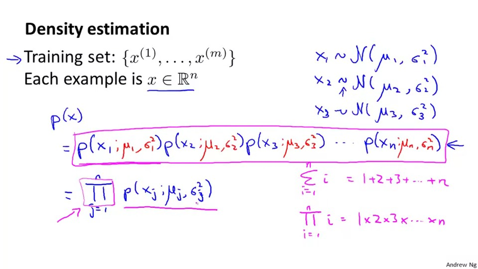
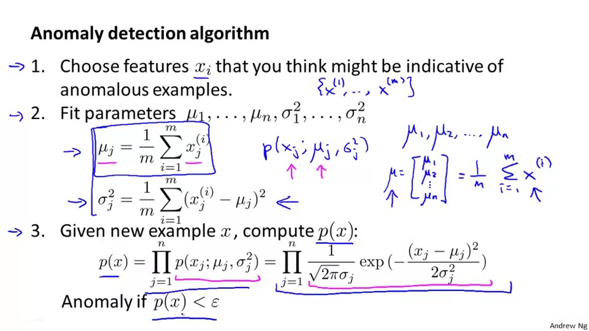
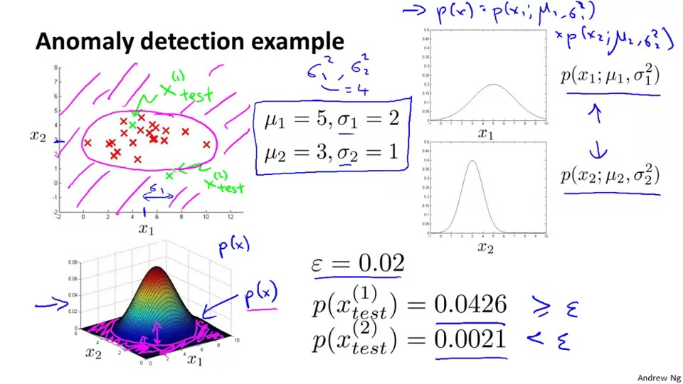

## Anomaly detection
We have trained a model with a cluster.But sometime the new example will lie out of the cluster we train. So we call it anomaly. But now to determine the example is anomaly or not?

If the model p(x) calculate the new example is smaller than a threshold sigma, we will call it anomaly, othervise we will call it ok

The anomaly detection will use in fraud detection/Manufactering.monitoring computers in a data centre.

## Gaussian Distribution
It is a brief introduction of normal distribution.

This function has 2 variables mu and sigma. mu is the mean of this distribution and sigma^2 is the variance of this distribution. The formula of this distribution is in below(no need to memorise) 

How does to the graph when changing the parameters?

If the value of sigma become smaller. the crest of the distribution is become narrow.

The value of the mu is the centre of the distribution

How to apply to machine learning?

mu is the mean of those example.

sigma^2 is the variance of those example.

## Density estimation algoithm
To build a algoithm, the p(x) of the algoithm is the multiplication of the p(x) of each feature.

How to calculate p(x)?
1.you need to first calculate mu and sigma
2.apply mu and sigma to the formula that compute p(x)

Applicatopn of anomaly detection

1. we calulate the p(x) first, wheer x is stands for the new example.

2. we compare the p(x) is greater than the threshold of not. if yes we determine it as anormaly,if not we treat it as ok.
